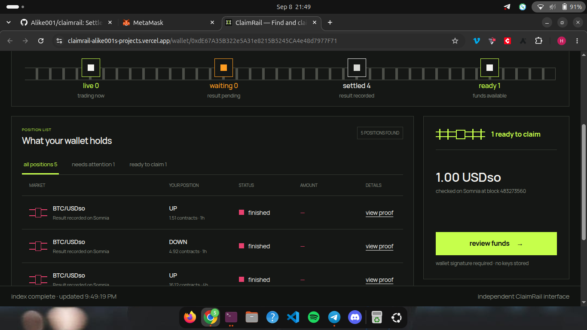

# ClaimRail

**ClaimRail finds finished DreamDEX positions on Somnia, explains the result, and helps the owner
claim available funds safely.**

DreamDEX handles the market and Somnia records the outcome. ClaimRail handles the last mile after the
trade: finding old positions, showing what happened, checking whether a payout is really available,
and guiding the owner through the claim.

## How it works

1. **Find** — enter any public wallet address. No sign-up or wallet connection is needed to look.
2. **Understand** — see positions grouped as open, waiting, finished, or ready to claim, with a
   plain-language explanation and on-chain evidence.
3. **Claim** — review the exact payout and DreamDEX action, then approve it in the owner wallet.
   ClaimRail never holds the funds or a private key.

The same verified lifecycle can also reach browser push, Telegram, signed webhooks, APIs, bots, and
agents.



_Deployed ClaimRail product before the owner-signed claim. The resulting transaction and independently
verified receipt are linked below._

## Why it belongs in the DreamDEX ecosystem

- It uses real Event Contract settlement, payout vectors, ERC-6909 positions, and `redeemMany`.
- It checks current Somnia contract state before presenting a financial action.
- It makes post-trade settlement understandable to non-technical users.
- It gives developers one normalized, signed event feed instead of making every product rebuild the
  same settlement logic.

## What is working

| Capability                                              | Status                                                                                                                                |
| ------------------------------------------------------- | ------------------------------------------------------------------------------------------------------------------------------------- |
| Public-wallet position discovery                        | Working against DreamDEX on Shannon testnet                                                                                           |
| Complete pagination and chain reconciliation            | Working; tested with 1,044 live indexed rows                                                                                          |
| Settlement explanation and evidence                     | Working                                                                                                                               |
| Safe owner-signed manual claim planning                 | Working; exercised with a real Shannon `redeemMany`                                                                                   |
| Durable receipt verification and history                | Real claim independently confirmed in production                                                                                      |
| Browser, Telegram, and signed-webhook delivery          | Browser and Telegram verified live; signed webhook tested in code                                                                     |
| REST API, OpenAPI, schemas, client, and Bot Kit adapter | Working                                                                                                                               |
| Public deployment                                       | [Live on Vercel](https://claimrail-alike001s-projects.vercel.app)                                                                     |
| Real browser delivery                                   | Verified live on the deployed product                                                                                                 |
| Owner-signed successful claim                           | [Confirmed on Shannon](https://shannon-explorer.somnia.network/tx/0x03172396dd2ba45d1f6c6d119d01029a2eb0b6fc8c13592c832293fe39666c11) |
| Final 2–3 minute video                                  | Script and live proof ready; recording pending                                                                                        |

Sample data is visibly labelled and cannot trigger a live transaction. A mined transaction is not called
successful until the worker verifies its envelope, receipt, `Redeemed` logs, payout, and post-claim
state.

## Try it locally

Requirements: Node.js 24, pnpm 10, Docker, and Chromium for the browser tests.

```bash
pnpm install --frozen-lockfile
cp .env.example .env.local
pnpm dev
```

Open `http://localhost:3000`. Paste a public Somnia wallet to perform a live read-only scan, or open
the clearly labelled sample from the landing page while running in development.

Run the complete engineering gate:

```bash
pnpm verify
pnpm test:e2e
```

`pnpm verify` checks formatting, lint, strict TypeScript, package boundaries, generated API artifacts,
fixtures, unit tests, coverage gates, integration tests, an ephemeral PostgreSQL database, and the
production build. The separate E2E command checks the consumer and developer journeys in desktop and
mobile Chromium.

## System at a glance

```text
DreamDEX indexer ── discovers wallets, markets, and positions
        │
Somnia contracts ── verify lifecycle, balances, settlement, and receipts
        │
ClaimRail worker  ── reconciles state, records events, and retries delivery
        │
PostgreSQL        ── stores plans, receipts, subscriptions, and audit history
        │
Web app + API     ── explains, prepares owner actions, and serves integrations
```

The indexer is used for discovery; current chain state gates claims. Pool addresses are recyclable,
so market identity is based on chain, module, and market ID. The browser wallet—not the server—signs
approval and redemption transactions.

Non-financial route and delivery-console permissions use standard, expiring Sign-In with Ethereum
messages bound to the exact ClaimRail origin. They cannot authorize a transaction or token approval.

## Deployment and submission

- [Live ClaimRail product](https://claimrail-alike001s-projects.vercel.app)
- [Verified production worker run](https://github.com/Alike001/claimrail/actions/runs/34284779776)
- [Confirmed owner-signed claim receipt](https://claimrail-alike001s-projects.vercel.app/claims/claim:0xa8420df93e2289abf4d0242ef540548bb49ce76e6053643346012b5f401c84ab)
- [Live browser-delivery proof](docs/hackathon/assets/live-browser-delivery-2026-09-08.png)
- [Live Telegram-delivery proof](docs/hackathon/assets/live-telegram-delivery-2026-09-09.png)
- [Telegram delivery worker run](https://github.com/Alike001/claimrail/actions/runs/34315378481)
- [No-card Vercel, Neon, and GitHub Actions guide](docs/operations/free-deployment.md)
- [Render deployment guide](docs/operations/render-deployment.md)
- [Owner launch and live-proof checklist](docs/operations/owner-launch-checklist.md)
- [Hackathon readiness board](docs/hackathon/readiness.md)
- [DoraHacks submission draft](docs/hackathon/dorahacks-submission.md)
- [2–3 minute demo script](docs/hackathon/demo-script.md)
- [DreamDEX SDK and documentation feedback](docs/hackathon/sdk-feedback.md)

The recommended hackathon path uses Vercel Hobby, Neon Free, and the checked-in GitHub Actions
worker. It has no card requirement, but the worker is periodic rather than continuously resident.
The root [`render.yaml`](render.yaml) remains an optional paid, always-on alternative. Secrets are
entered only in provider secret stores and must never be committed.

## Developer entry points

- `apps/web` — Next.js product, REST API, and documentation.
- `apps/worker` — continuous reconciliation, receipt, outbox, and delivery jobs.
- `packages/core` — dependency-free settlement and claim rules.
- `packages/dreamdex` — pinned DreamDEX SDK plus on-chain verification adapter.
- `packages/db` — PostgreSQL and Drizzle persistence.
- `packages/contracts` — public runtime schemas and generated API artifacts.
- `packages/client` — validated TypeScript client and webhook verifier.
- `examples/webhook-consumer` — signed webhook receiver.
- `examples/bot-kit-adapter` — DreamDEX strategy pause/claim/confirm handoff.
- `probes/event-contracts` — reproducible, signer-free protocol evidence.

For the complete product contract and implementation history, see the
[specification](.thoughts/specs/2026-09-03-claimrail.md) and
[implementation plan](.thoughts/plans/2026-09-03-claimrail-implementation.md).

## Safety boundary

ClaimRail never accepts or stores a private key. Server-side claim preparation has no signer,
requires a fresh complete scan, excludes zero-paying entries, and simulates every final batch.
Submitted hashes remain pending until independent reconciliation finishes. Gas-sponsored claiming is
not shipped and is not claimed as a current feature.
